## Download Virtualbox:
* [Windows](https://download.virtualbox.org/virtualbox/6.1.4/VirtualBox-6.1.4-136177-Win.exe)
* [MacOS](https://download.virtualbox.org/virtualbox/6.1.4/VirtualBox-6.1.4-136177-OSX.dmg)
* [Linux](https://www.virtualbox.org/wiki/Linux_Downloads)

## Download virtual machine appliance here:
* [CS434-OracleSQL-W7x64VM.ova](https://studentlaccd-my.sharepoint.com/:u:/g/personal/gukasos_laccd_edu/EXG8mnINdJdOujL4aq_tA1kBxkoSHLGjOWqQI5xiH8f6gA?e=eb6QQ6) (11.5GB)

## Instructions:
1) Download and install Virtualbox using one of the links above.
2) Download Virtual Machine appliance (.ova) and save it on your computer.
3) Open Virtualbox. On the left hand panel select "Tools", and then on the main ribbon "**Import**" 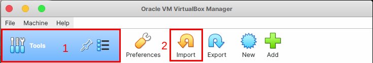
4) Under "File" field, select the previously downloaded **CS434-OracleSQL-W7x64VM.ova** and click **Next** 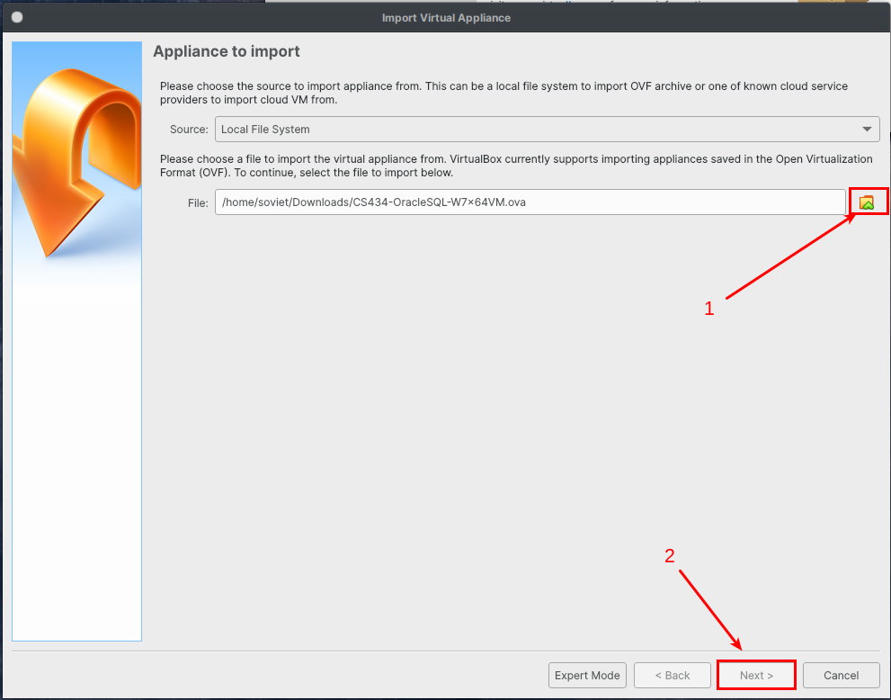
5) Depending on your computer you may need to modify some settings for the appliance. 
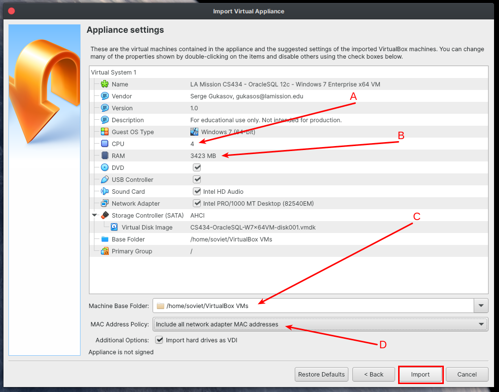
    **A**) Set the number of CPU cores to dedicate for the appliance. Standard practice is to assign half the system cores. If you're not sure how many cores to assign, 2 is a safe number to use. 
    **B**) Set amount of RAM in megabytes. If your computer has 8+ GB total you can leave this value at default. If you have less than 8GB memory you can set it as low as 2500MB.
    **C**) Base folder: folder where virtual machine will be saved to. Make sure you have at least 15GB of free space on the disk. 
    **D**) You *MUST* change this to "**Include all network adapter MAC addresses**"

    Leave the rest as-is, click "**Import**", and wait few minutes for the process to finish.
6) After the import process is complete, you will see your virutual machine instance appear on the left hand side of Virtualbox as **LA Mission CS434 - Oracle 12c - Windows 7 Enterprise x64 VM**. Click on it, and click **Start** on the main ribbon. 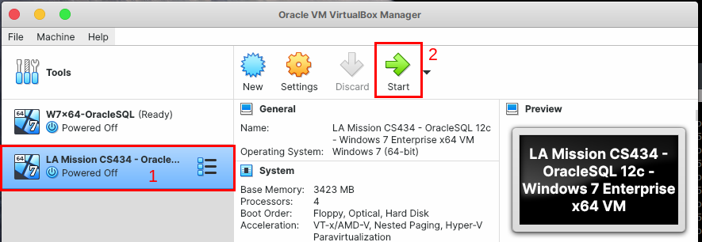
7) After your machine boots, it is a good practice to take a snapshot. Snapshots are useful in case you break something, and want to quickly go back to last working state. The advantage of snapshots is they take only a few seconds to capture/recover. To take a snapshot, in a virtual machine window click on **Machine** -> **Take Snapshot**  
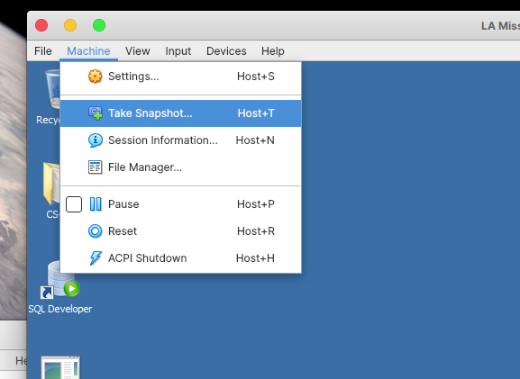  

In the new window give it a descriptive name (I used "Default State") and click OK.  
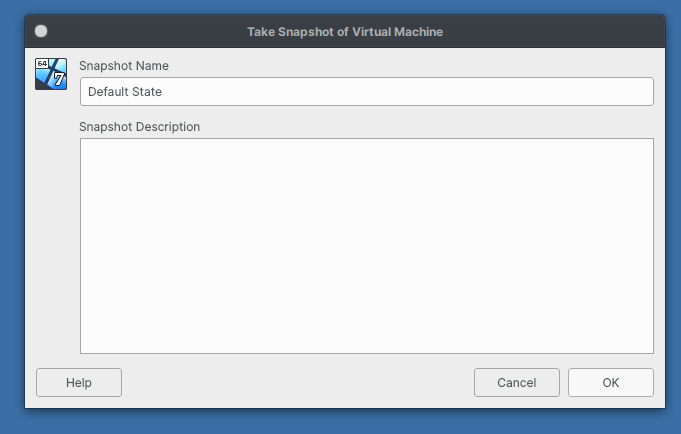 
8) You are done! SQL Developer, SQL Plus shortcuts, and CS434-specific files are available on the desktop of the virtual machine. 
9) When you are finished using virtual machine, in order to close it click on "Start" -> Shutdown
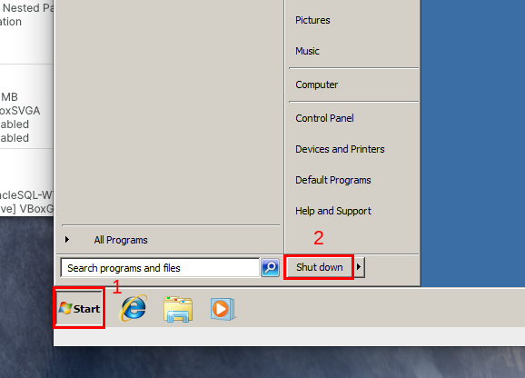

# FAQ
## I did something and now my database is broken! How do I recover?
This is where snapshots come into play. In this example I accidentally deleted CS434 connection from SQL Developer. 

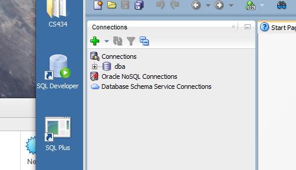

In order to restore a snapshot, while your virtual machine is running, inside the virtual machine window click **File** -> **Close...** 

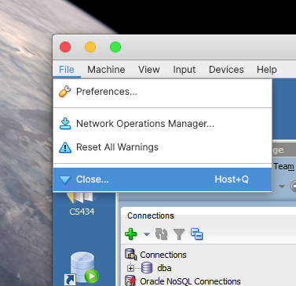

Select "**Restore current snapshot to 'Default State'**", and click OK

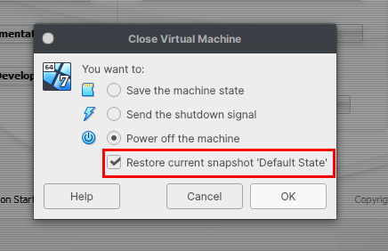

After your virtual machine shuts down, start it again from Virtualbox by double clicking on the Virtual Machine on the left hand panel. You will see a brief status window for restoration process. After snapshot recovers, if we check SQL Developer we will find CS434 is back as if nothing ever happened!

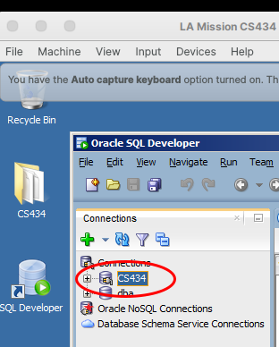

## I did something and now the whole VM is broken, and snapshots cannot fix it(or I never took a working snapshot)! What can I do?
If you break the VM to a point where snapshots can not fix it, please follow the guide from the beggining to re-import the appliance from scratch.

## I accidentally set the wrong settings while importing the appliance. Can I still change them after importing?
Yes. In VirtualBox, on the left hand panel, right click on the virtual machine -> **Settings**. You will find all the settings (and more) there.

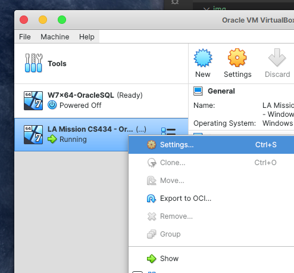

### Further help
If you are having issues, or have questions beyond what's covered in this manual, feel free to contact me via email gukasos@lamission.edu
